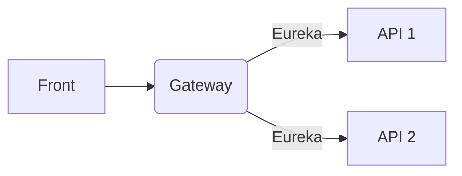

Front 에서 Gateway 를 갈때 feign 을 굳이 쓰지 말고, 차라리 nginx 를 로드밸런서로 써도 괜찮을 것 같다.

feign 이 nginx 보다 장점이라 생각되는 부분은 resilience4j 기능적인 부분인데, 이게 필요할지는 잘 모르겠다. 

EDA 과 API 를 적절히 잘 버무리자. MSA 아키텍쳐는 배우면 배울수록 고려해야할 부분이 참 많은 것 같다.
